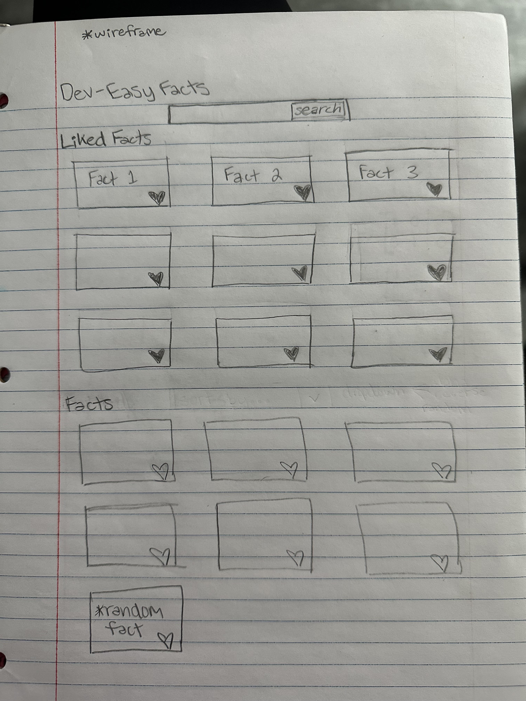

# 🧠 dev-easy-group-project2

## 🚀 Overview  
This project was developed by Easy Group 3 as part of our Web Development course.  
The goal was to create a fun and interactive webpage that presents a random fact to students, enhancing engagement and delivering quick, interesting info.

---

## 👥 Team Members

- Corey Butler 
  - GitHub: [CoreyBut](https://github.com/CoreyBut)  
  - LinkedIn: [corey-butler-11b42635b](https://www.linkedin.com/in/corey-butler-11b42635b/)
- Carson Kerr  
- Reed Willis  
- Tatum Duthu  
- Cohen Cantrell  

---

## 🔗 Live Demo

👉 [reedwillis.github.io/dev-easy-group-project](https://reedwillis.github.io/dev-easy-group-project)

---

## 🛠️ Technologies Used

- HTML5  
- CSS3  
- JavaScript

---

## 📂 Project Structure
dev-easy-group-project2/ ├── index.html ├── styles/ │ └── style.css ├── scripts/ │ └── script.js ├── devEasyWireframe.jpg └── README.md

---

## 🧪 Sample Code

```javascript
fetch('https://api.example.com/randomfact')
  .then(response => response.json())
  .then(data => {
    document.getElementById('fact').textContent = data.fact;
  });
```

## 🔄 Recent Changes
- Removed hardcoded facts
+ Integrated external API to fetch dynamic facts

---

## 💬 Quote
“The beautiful thing about learning is that nobody can take it away from you.” – B.B. King

---

## ✅ Future Enhancements
 Add user authentication to personalize facts
 Implement a feature to share facts on social media
 Enhance mobile responsiveness


## 🖼️ Preview


